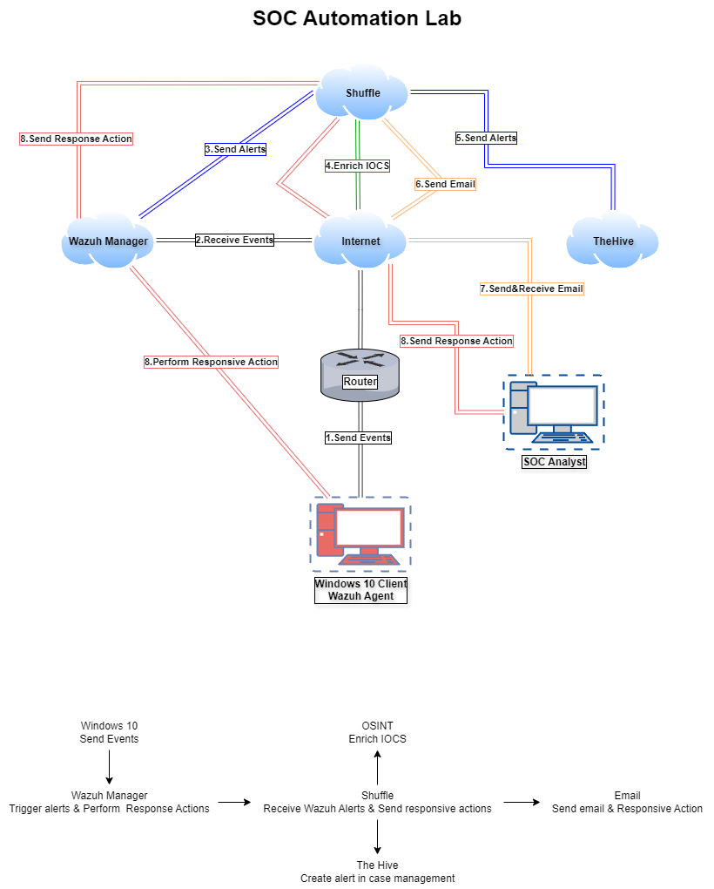
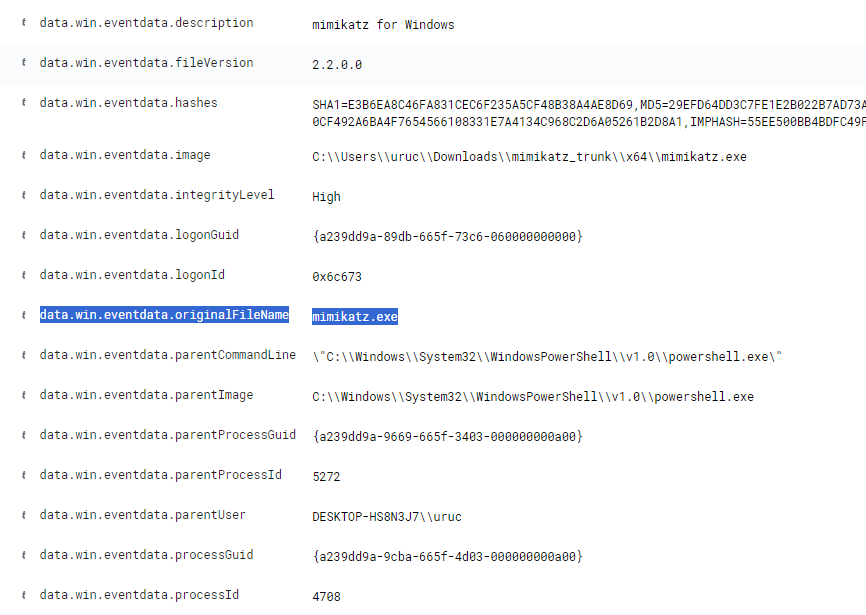
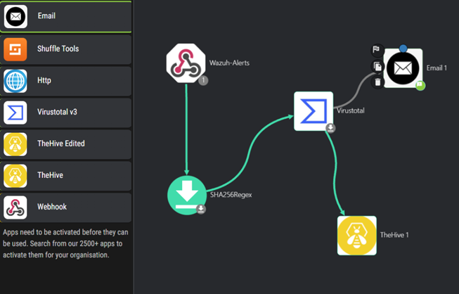
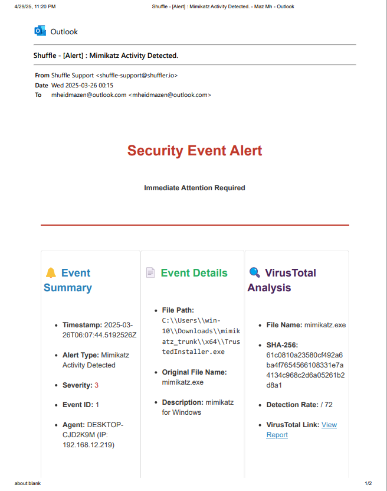

# SOC Automation Lab

  
  
  
  
  

## Overview
This project presents a hands-on Security Operations Center (SOC) Automation Lab designed to simulate real-world security monitoring, alert enrichment, and incident response workflows.

The lab integrates Wazuh (SIEM), Shuffle (SOAR), and TheHive (incident response platform) to automate detection, analysis, and case creation.

## Architecture Diagram

This diagram illustrates the end-to-end SOC workflow, including log collection, alert detection, enrichment, and automated incident response using Wazuh, Shuffle, and TheHive.

## Workflow
1. Sysmon generates endpoint logs
2. Wazuh analyzes logs and triggers alerts
3. Alerts are sent to Shuffle via webhook
4. Shuffle extracts indicators (hash/IP)
5. VirusTotal enriches the alert
6. TheHive creates a case automatically
7. Analyst reviews and investigates

## Objectives
- Detect suspicious activity using Wazuh
- Automate alert enrichment using VirusTotal API
- Build automated workflows using Shuffle (SOAR)
- Create incident cases in TheHive
- Simulate SOC analyst investigation process

## Architecture
- Wazuh (SIEM) on Ubuntu
- TheHive (Case Management)
- Shuffle (SOAR automation)
- Windows 10 endpoint with Sysmon

## Detection Example
- Attack: Credential Dumping
- Tool: Mimikatz
- MITRE ATT&CK: T1003

## Tools Used
- Wazuh
- TheHive
- Shuffle
- Sysmon
- VirusTotal API

## Results
- Successful detection of simulated attacks
- Automated case creation
- Real-time alert enrichment
- Reduced manual SOC workload

## Lessons Learned
- SOC automation improves response speed
- SIEM + SOAR integration is powerful
- Open-source tools can build real SOC environments
- SOC automation improves response speed
- SIEM + SOAR integration is powerful
- Open-source tools can build real SOC environments

## Sample Investigation
- [Mimikatz Credential Dumping Investigation](investigations/mimikatz-investigation.md)

## Screenshots

### TheHive Alert Dashboard

### TheHive Case Details

### Wazuh Alert (Credential Dumping Detection)

### Shuffle SOAR Workflow

### Automated Email Alert (SOAR Output)

