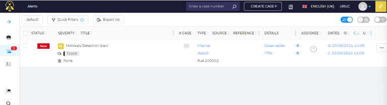
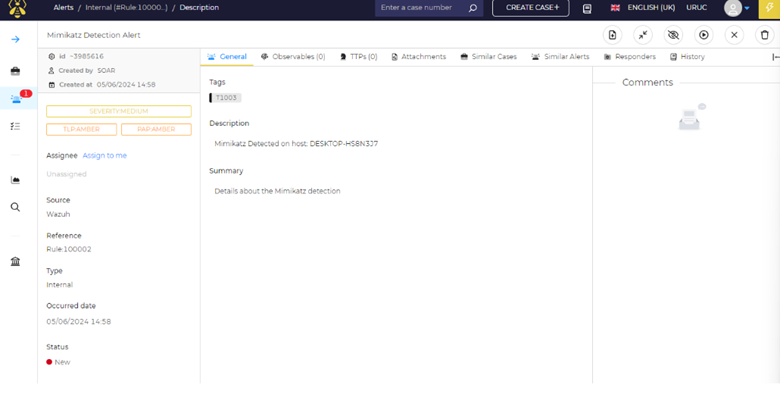

# SOC Investigation: Mimikatz Credential Dumping

## Summary
This investigation analyzes a simulated credential dumping attack using Mimikatz within a SOC automation lab environment.

## Alert Source
- SIEM: Wazuh
- Endpoint: Windows 10 with Sysmon
- MITRE ATT&CK: T1003

## Detection
A custom Wazuh rule detected suspicious activity related to LSASS access.

## Investigation Steps
1. Reviewed Wazuh alert
2. Identified suspicious process
3. Checked Sysmon logs
4. Verified behavior matches credential dumping
5. Enriched alert using VirusTotal

## Findings
The activity matched known credential dumping behavior targeting LSASS memory.

## Response Actions
- Isolate endpoint
- Terminate malicious process
- Reset credentials
- Monitor for further activity

## Conclusion
The SOC automation workflow successfully detected and processed the incident, demonstrating effective SIEM and SOAR integration.

## Evidence

### Alert Overview

### Case Details

